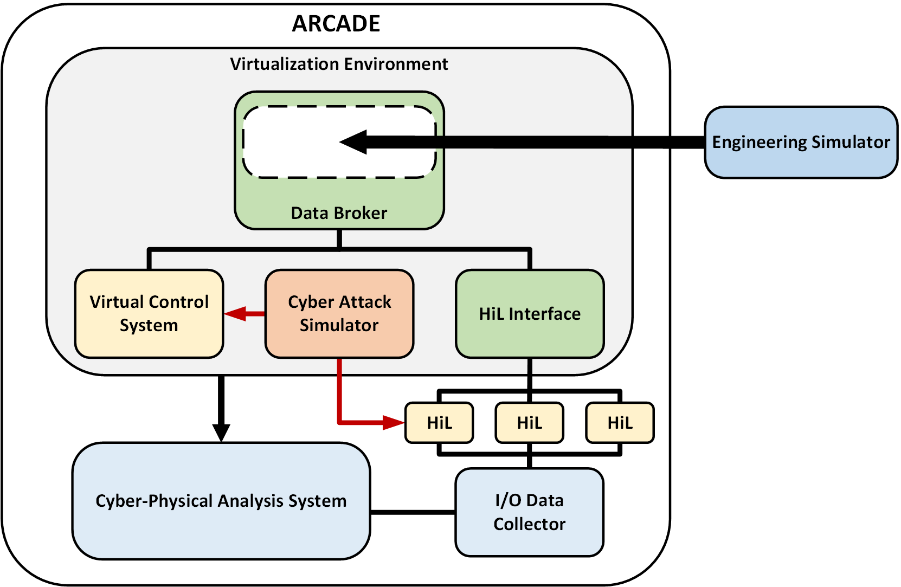

# ARCADE

ARCADE (Advanced Reactor Cyber Analysis and Development Environment) is a collection of tools designed to enable researchers to perform cybersecurity experiments on Defensive Cyber Security Architectures (DCSA) for Distributed Control Systems (DCSs). These tools are integrated into a cohesive environment that extends the usefulness of these tools to perform cyber risk analysis and reduce analysis cost. Using ARCADE, it will be possible to investigate the entire cyber-attack surface of a DCS from the physics of control, down to the firmware of individual components with automated efficiency. ARCADE can be described is five major functional components: the Data Broker system, the virtualization environment, the cyber attack simulator, the cyber-physical analysis system, and the physics simulator.

Please see our publications below for more details:

- https://event.fourwaves.com/65inmm/abstracts/deb6f23b-c4a1-4406-b1bc-0bc21ff949f1
- https://www.ans.org/pubs/proceedings/article-53841/
- https://www.trtr.org/wp-content/uploads/2023/05/Advanced-Reactor-Cyber-Analysis-and-Development-Environment-ARCADE-Lee-Maccarone.pdf

Each section of this repository contains instructions for setting up each piece of ARCADE. 

Copyright 2024 National Technology & Engineering Solutions of Sandia, LLC (NTESS). Under the terms of Contract DE-NA0003525 with NTESS, the U.S. Government retains certain rights in this software.
